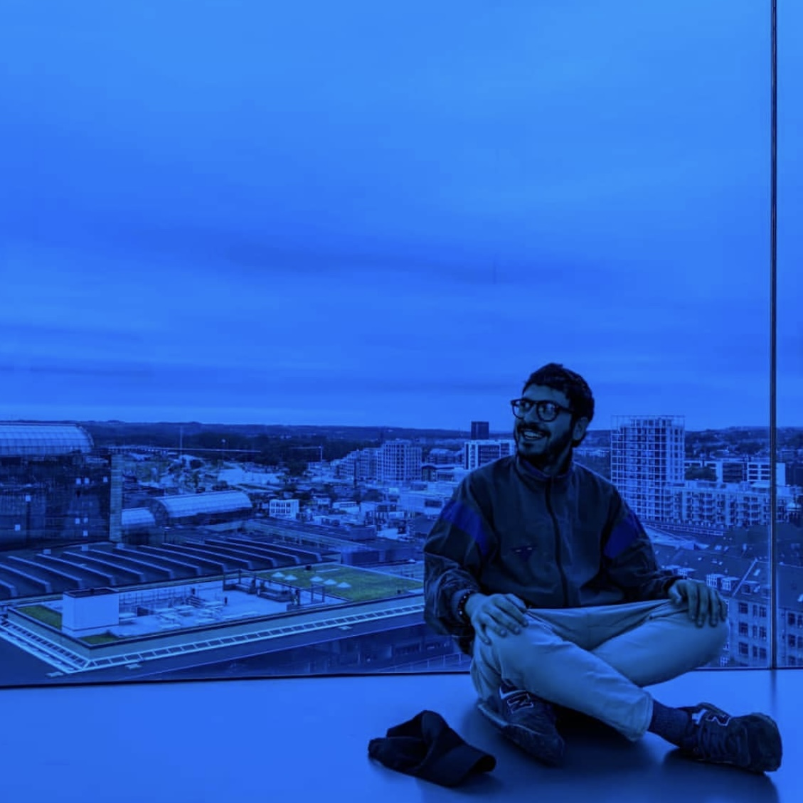

<h1 align="center">Simone Laera</h1>

<p align="center">
  
</p>

<p align="center">
  <b>Developer & Football Data Scientist</b> — Bologna, Italy<br>
  <a href="https://simone-laera.github.io/about/"><b>→ Visit the website</b></a>
</p>

---

Hello, this is Simone.

I am a Developer and Football Data Scientist based in Bologna (Italy).

Methodic and thoughtful: *problem posing and problem solving are my guidelines*.
I firmly believe in the power of numbers and data to draw a reliable map for any creation process (*as the ball conduction below*).

<p align="center">
  
</p>

---

## What is this repository?

This is the source code of my **personal website**, built with [Quarto](https://quarto.org) and published on GitHub Pages.
It collects my professional profile and a portfolio of football data projects — mostly **graphical representations** of models built on raw Tracking and Event data.

> Due to the intellectual property policies of the company I work for, the source code of the football models is not publicly shared: this site presents their visual output only.

### Contents of the site

| Page | File | What you find there |
| --- | --- | --- |
| **About** | `index.qmd` | Short intro and profile |
| **Tracking Models (Viz)** | `visuals.qmd` | Tracking-data projects: 2D match rendering, individual focus, team shapes, space coverage, Pitch Control, passing networks, dynamic formations, dangerous choices, field of view, motion interactions |
| **Data-driven contents** | `side_football.qmd` | Event-data pills: passing networks, pass risk model, automated media content (*e.g. DAZN*) |
| **Side Projects** | `side.qmd` | Non-football projects, such as [SCIAMN Fest](https://www.instagram.com/sciamn_fest/) |
| **Contacts** | `contact.qmd` | How to get in touch |

### Repository layout

```
_quarto.yml        # website config: sidebar, navigation, format
index.qmd          # home / About page
visuals.qmd        # football tracking projects
side_football.qmd  # event-data driven contents
side.qmd           # side projects
contact.qmd        # contacts
cv.qmd             # CV page (currently not linked in the sidebar)
styles.css         # custom CSS
viz/               # videos, GIFs and images of the projects
_extensions/       # Quarto extensions (fontawesome)
.github/workflows/ # GitHub Action: render and publish to gh-pages
```

## Build it locally

Requires [Quarto](https://quarto.org/docs/get-started/):

```bash
quarto preview     # live preview at http://localhost:4200
quarto render      # static build into _site/
```

## Deployment

Every push to `main` triggers the [`Quarto Publish`](.github/workflows/publish.yml) workflow, which renders the site and publishes it to the `gh-pages` branch — served at **https://simone-laera.github.io/about/**.
The rendered output (`_site/`, `.quarto/`, `_freeze`) is git-ignored: only the sources live on `main`.

## Tools

`Python` (pandas, PyTorch, mplsoccer, OpenCV, YOLO) · `Quarto` · `R` · tracking data from *Hawkeye* and *OptaVision*

## Contacts

📍 Bologna, Italy · ✉️ simonelaera.soccer@gmail.com
[Twitter](https://x.com/simonelaera) · [Instagram](https://www.instagram.com/simonelaera)
